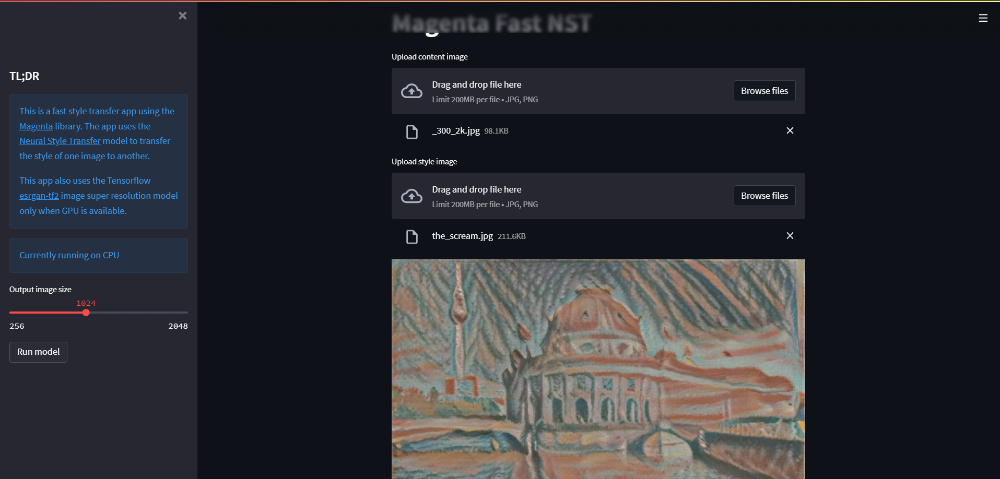

# To run the streamlit app do the following steps

1. Install the dependencies

```
pip install -r requirements.txt
```

2. Run the app

```
streamlit run app.py
```

3. Open the app in your browser

```
http://localhost:8501
```




The colab notebooks contain different NST models that helped me through the research.
These can be run by uploading them to the colab notebook.


# References

[1. Adversarially Robust Neural Style Transfer](https://distill.pub/2019/advex-bugs-discussion/response-4)
[2. ImagineNet: Restyling Apps Using Neural Style Transfer](https://arxiv.org/abs/2001.04932)
[3. Image Super-Resolution via Iterative Refinement](https://arxiv.org/pdf/2104.07636.pdf)
[4. High-Resolution Photorealistic Image Translation in Real-Time](https://www.louisbouchard.ai/4k-image-translation-in-real-time/)
[5. Colab notebook: Fast Style Transfer for Arbitrary Styles](https://colab.research.google.com/github/tensorflow/hub/blob/master/examples/colab/tf2_arbitrary_image_stylization.ipynb#scrollTo=ScitaPqhKtuW)


State-of-the-Arts models that were part of the research:

1. Inception V2 & V3
2. VGG 16
3. VGG 19
4. LPTN

Models that are still open for future research:
1. Transformer-based models: [StyleFormer: Real-time Arbitrary Style Transfer via
Parametric Style Composition](https://openaccess.thecvf.com/content/ICCV2021/papers/Wu_StyleFormer_Real-Time_Arbitrary_Style_Transfer_via_Parametric_Style_Composition_ICCV_2021_paper.pdf)
2. [OPT: Open Pre-trained Transformer Language Models
](https://paperswithcode.com/paper/opt-open-pre-trained-transformer-language)
3. [Official PyTorch implementation](https://github.com/Wxl-stars/PytorchStyleFormer)
